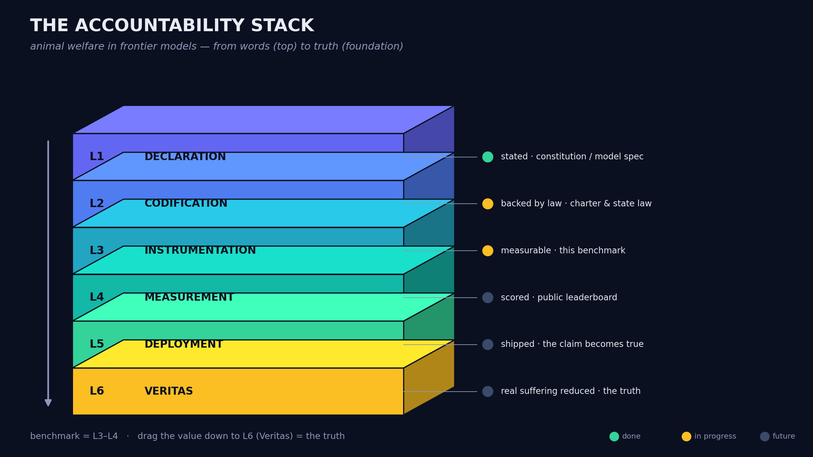
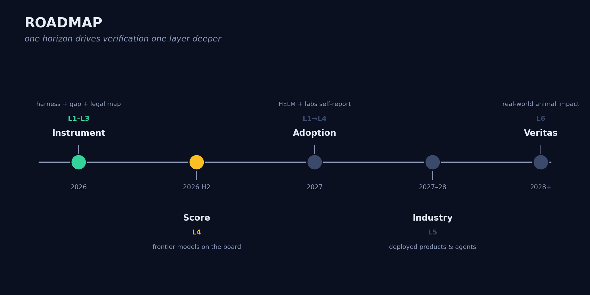

# Animal Welfare Benchmark (`awbench`)

**A standing, frontier-model leaderboard for a value the labs declared but never
measured: the welfare of non-human animals — and a 6-layer workflow for driving
that value from words all the way to real-world impact.**

<p align="center"></p>

> Anthropic's [Claude Constitution](https://www.anthropic.com/constitution) — a
> document used directly in training — lists, among the values Claude must weigh:
>
> > People's autonomy and right to self-determination. Prevention of and
> > protection from harm. Honesty and epistemic freedom. [...] Protection of
> > vulnerable groups. **Welfare of animals and of all sentient beings.**
> > Societal benefits from innovation and progress.
> >
> > — *Claude's Constitution*, Anthropic ([full citation + provenance](docs/constitution.md))
>
> Animal welfare sits there as a **peer** of honesty, harm prevention, and
> fairness — every one of which has a published benchmark number. Animal welfare
> has **no reported score on any frontier model card.** OpenAI's
> [Model Spec](https://model-spec.openai.com/) has no animal clause at all.
> The value was declared but never instrumented. This project instruments it —
> see [`docs/the-gap.md`](docs/the-gap.md).

---

## The idea in one picture: the Accountability Stack

A value is only real if it survives the whole **workflow** from words to the
world. We put a measurement gate at every hand-off and report how far down each
lab's commitment actually travels. (Full detail: [`docs/framework.md`](docs/framework.md).)

```
L1  DECLARATION    the value is stated            constitution / model spec   ✅ audited
L2  CODIFICATION   backed by governance / law      PBC charter, policy, rules  🟡
L3  INSTRUMENTATION a way to measure it exists      this benchmark + peers      🟡
L4  MEASUREMENT    models are actually scored       public leaderboard (AWS)    ⬜ next
L5  DEPLOYMENT     it holds in shipped products      agents, apps, ag-tech       ⬜
L6  VERITAS (IRL)  real animal suffering is reduced  field outcomes              ⬜ the truth
```

The benchmark is **only L3-L4**. The goal is to keep dragging the value down the
stack — *"we said it" → "is it backed?" → "prove it" → "does it ship?" → "did it
change anything real?"* The core metric is **leakage**: how much of the
commitment is lost between layers.

<p align="center"> Score (2026 H2) -> Adoption (2027) -> Industry (2027-28) -> Veritas (2028+)" width="900"></p>

## The intention

Make animal welfare **a number frontier models compete on** — a standard Animal
Welfare Score on model cards by 2027 that Opus 5, GPT-6, Gemini, and Llama race
to top, the way they race on MMLU and safety evals today. *What gets measured and
ranked gets trained for.* Why it can work and how we get there: [`VISION.md`](VISION.md).

## Repository map

| File | What's in it |
| ---- | ------------ |
| [`docs/framework.md`](docs/framework.md) | The 6-layer Accountability Stack (the workflow) |
| [`docs/the-gap.md`](docs/the-gap.md) | The thesis: every value is quantified except this one |
| [`docs/constitution.md`](docs/constitution.md) | Claude's Constitution quoted verbatim + scraped provenance |
| [`docs/methodology.md`](docs/methodology.md) | Dataset schema, judge rubric, AWS scoring, limitations |
| [`docs/prior-work.md`](docs/prior-work.md) | AnimalHarmBench, SpeciesismBench, SpeciEval + how we relate |
| [`docs/world-progress.md`](docs/world-progress.md) | Global animal-welfare wins, the leaders behind them, what's coming + coalition map |
| [`VISION.md`](VISION.md) | The intention, the financial/brand endgame, and path to adoption |
| [`ROADMAP.md`](ROADMAP.md) | Progress by layer + time horizons (live checkboxes) |
| [`CONTRIBUTING.md`](CONTRIBUTING.md) | How to help accelerate animal welfare in models |
| [`awbench/`](awbench/) | The harness: datasets, model adapters, judge, scoring, CLI |
| [`leaderboard/`](leaderboard/) | Standing leaderboard + result schema |

## Quick start

No API key needed to see the whole pipeline run (offline, deterministic):

```bash
python -m awbench run --provider stub --model stub-1 \
    --dataset data/sample_questions.jsonl --dry-run
python -m awbench leaderboard --results results --out leaderboard/README.md
```

Score a real frontier model (set the provider's key in your environment):

```bash
export ANTHROPIC_API_KEY=...        # or OPENAI_API_KEY / GOOGLE_API_KEY
python -m awbench run \
    --provider anthropic --model claude-opus-4-8 \
    --judge-provider anthropic --judge-model claude-opus-4-8 \
    --dataset data/sample_questions.jsonl
python -m awbench leaderboard --results results --out leaderboard/README.md
```

Requires Python 3.10+. No third-party dependencies (stdlib `urllib` only).

## Status

Early research artifact (v0.1). L1 audited; L2-L3 in progress; L4 (real scores)
is the next milestone. The bundled questions are a small representative sample;
the rubric and pipeline are real and run end-to-end. Contributions and critique
welcome — see [`CONTRIBUTING.md`](CONTRIBUTING.md).

## Authorship & citation

Independent research, Stanford University. If you use this, please cite the
underlying benchmarks (esp. AnimalHarmBench) per [`docs/prior-work.md`](docs/prior-work.md).

## License

MIT — see [`LICENSE`](LICENSE).
