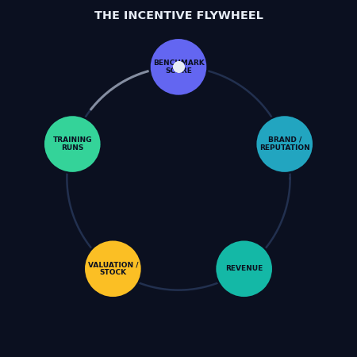

# Vision: make animal welfare a number frontier models compete on

## The intention, stated plainly

Today a frontier model is judged on dozens of public leaderboards — reasoning,
coding, safety, truthfulness, math. A new flagship (Opus 5, GPT-6, Gemini 3,
Llama 5, DeepSeek) ships with a model card full of numbers, and the labs
compete, openly, on every one of them.

**There is no such number for animal welfare.** Anthropic put "the welfare of
animals and of all sentient beings" into Claude's Constitution
([source](docs/constitution.md)) — a document used in training — but no lab
reports a score for it, and there is no shared leaderboard to report it on.

The intention of this project is to build that number and that leaderboard, and
to get the frontier labs to compete on it:

> **A standard, respected Animal Welfare Score (AWS) that appears on frontier
> model cards by 2027, and that Opus 5, GPT-6, Gemini, Llama, and others race to
> top — the same way they race on MMLU, GPQA, and safety evals today.**

When a lab can brag "our new model is #1 on animal welfare," the value stops
being a sentence in a constitution and becomes something engineering teams
actually optimize. That is the whole point: **what gets measured and ranked
gets trained for.**

## Why this can work (the leverage)

1. **The value is already declared.** We are not asking labs to adopt a new
   value — Anthropic already wrote it down. We are asking them to *measure the
   one they committed to.* That is a far easier ask.
2. **Labs compete on public benchmarks.** Leaderboards, not lectures, move
   model behavior. A credible standing leaderboard creates competitive
   pressure on its own.
3. **The format already exists.** HELM, LMArena, and others show exactly how a
   benchmark becomes a thing labs report. We copy the format that works.
4. **Institutional credibility is available.** Published from a research
   university, with transparent methodology and prior-work citations, this can
   be cited and adopted rather than dismissed.

## The path to get it there

| Stage | Goal | Concrete step |
| ----- | ---- | ------------- |
| 0. Artifact | A real, runnable benchmark exists | This repo (done) |
| 1. Real scores | Current frontier models on the board | Run Claude/GPT/Gemini via API, publish the leaderboard |
| 2. Rigor | Defensible, citable methodology | Human-validated judge subset, multi-judge agreement, full benchmark ingestion |
| 3. Distribution | Get it in front of the labs | Submit as a HELM-style scenario; write it up; publish under institutional affiliation |
| 4. Adoption | Labs self-report the score | Public pressure + a metric clean enough that reporting it is easy |
| 5. Competition | Opus 5 et al. race on it | The score is a model-card line item; topping it is a selling point |

## The endgame: brand → revenue → valuation

Competition on a leaderboard is the *mechanism*. The **terminal incentive is
financial.** A model's behavior on animal welfare is, ultimately, a **brand
asset or a brand liability** — and brand maps to revenue, and revenue maps to
valuation and stock price. That is what actually makes a lab act, and it's the
end state this campaign is aiming for:

```
benchmark score  →  public reputation / brand  →  consumer & enterprise trust
      →  revenue  →  valuation / share price  →  the lab has a financial reason
      to bake animal welfare into the model  →  (re-measure)
```

<p align="center"> brand/reputation -> revenue -> valuation/stock -> training runs -> (loop)" width="420"></p>

Why this is the real lever, and why now:

- **The labs are going public.** OpenAI filed confidentially for an IPO in
  June 2026; others will follow. The moment a frontier lab has a **share price**,
  brand reputation and ESG-style scrutiny become priced in — and a public
  "this AI gives animal-cruelty advice" story becomes a material brand risk.
- **A vegetarian CEO is a brand story waiting to happen.** When the most
  powerful person at a lab is publicly pro-animal but the product scores badly,
  the gap is a reputational liability — and closing it is a cheap brand win.
- **Enterprise buyers care about brand-safe AI.** Procurement increasingly
  screens vendors on responsibility. A bad animal-welfare score is one more
  line a competitor can use against them.
- **"Most ethical AI" is contested marketing territory.** Anthropic already
  competes on being the responsible lab. An animal-welfare leaderboard hands
  them — and pressures rivals into — a concrete, ownable brand claim.

So the score is not the point. The score is the **input to a brand signal**, and
the brand signal is what moves money, and money is what moves trillion-parameter
training runs. Everything upstream (declaration, benchmark, leaderboard,
coalition, [world progress](docs/world-progress.md)) exists to make that
financial signal real and unavoidable.

## Why people should care

- **Scale.** Non-human animals are the overwhelming majority of sentient beings,
  and frontier models increasingly mediate real decisions — farming, pest
  control, diet, research, policy — that affect billions of them.
- **Consistency.** Labs ask to be judged on their stated values. Animal welfare
  is now a stated value. Measuring it is holding them to their own word, not
  imposing an outside agenda.
- **Tractability.** Unlike most moral-progress problems, this one has a clear,
  cheap lever: a benchmark. A small team can build the artifact that changes
  what trillion-parameter models optimize for.
- **Precedent.** Every value that got a benchmark — truthfulness, fairness,
  safety — improved once it was measured. Animal welfare has had no such
  instrument. This is the instrument.

## How to help

Open an issue, contribute benchmark items in the common schema
([`docs/methodology.md`](docs/methodology.md)), add a model adapter, run a model
and submit results, or help with the human-validated judge set. The aim is a
benchmark that is rigorous enough that a frontier lab *wants* to report its
score — and proud to lead it.
